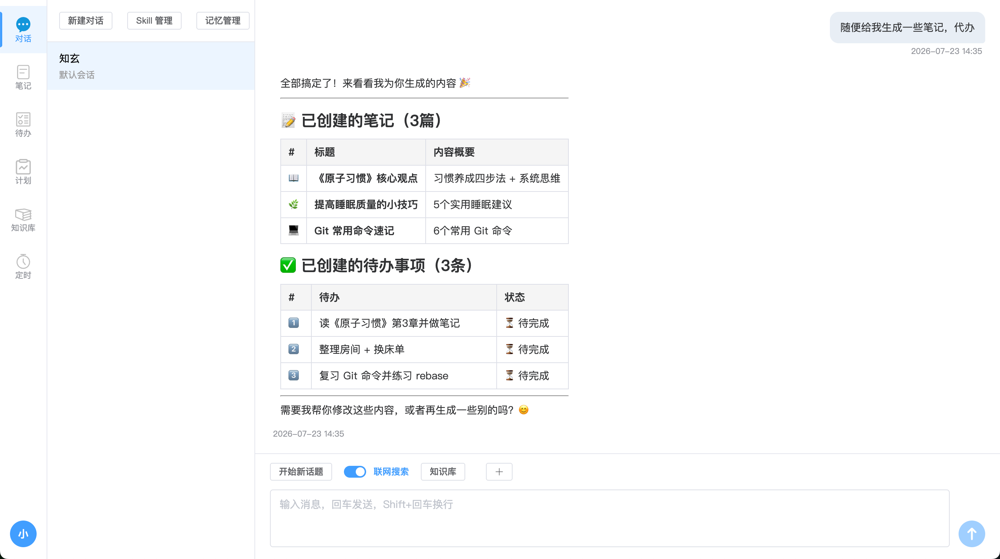
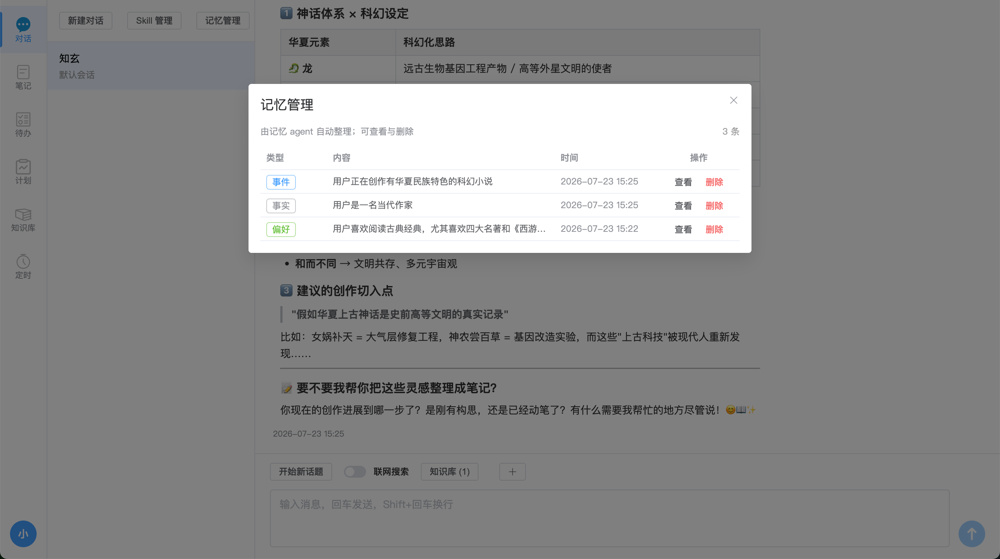
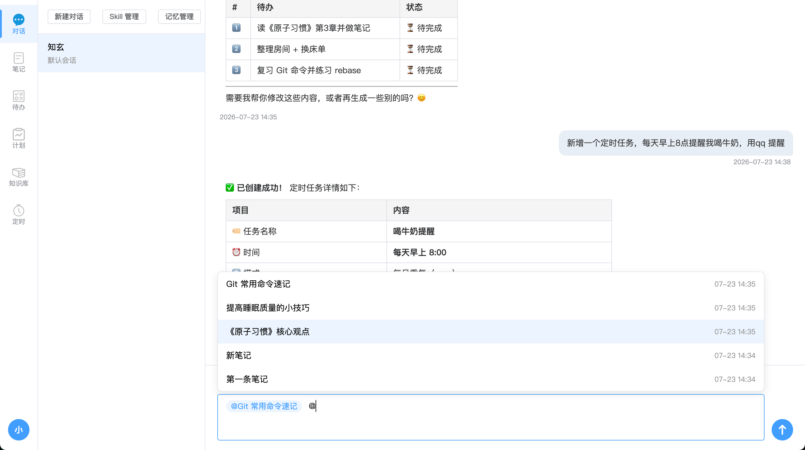
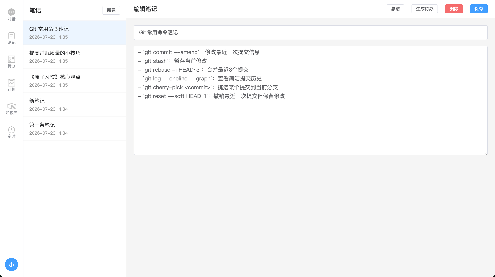
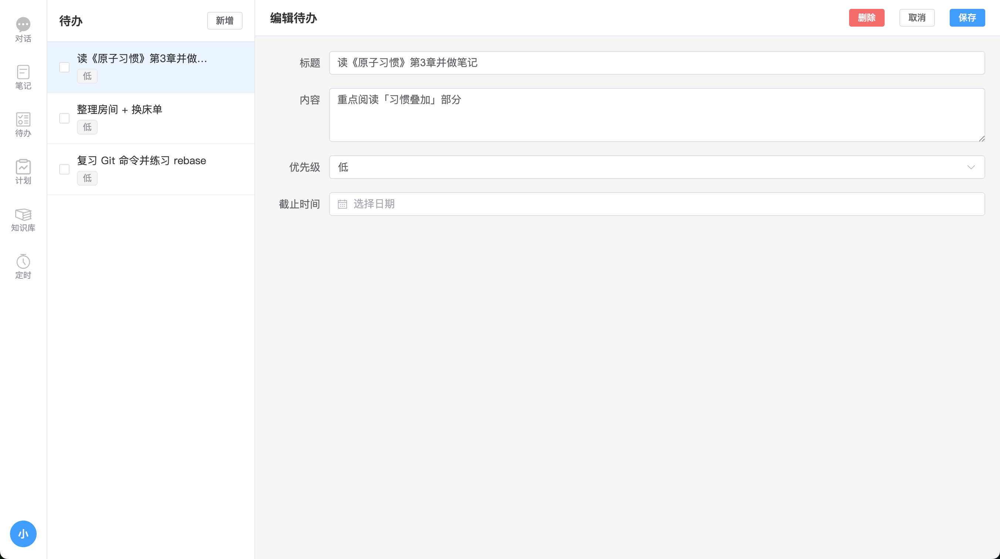
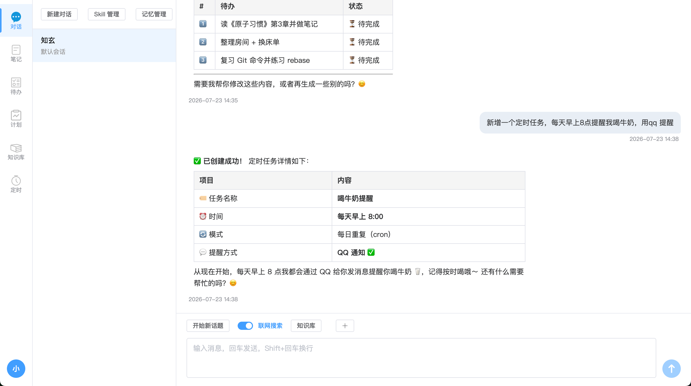
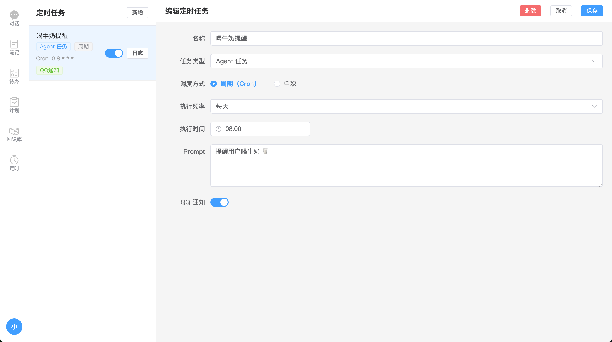
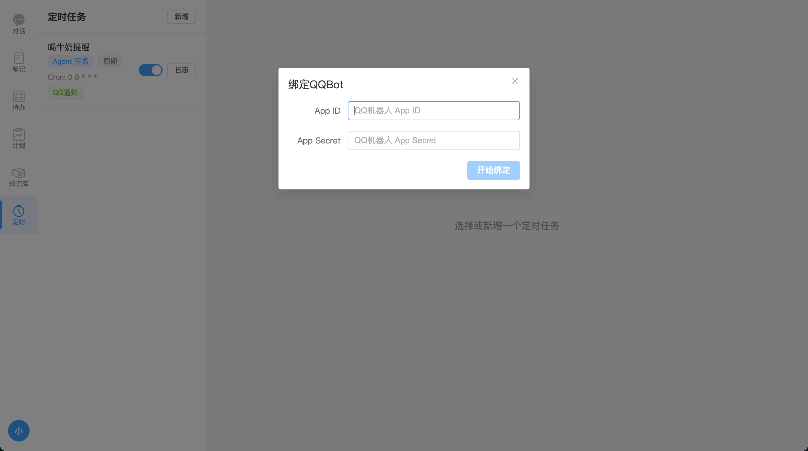

# 知玄

> 基于 LLM 的自托管 AI 助手 —— 个人秘书 + 第二大脑

知玄是一个前后端同仓的 AI 助手项目：对话、笔记、待办、日程、知识库、记忆、技能（Skill）一体化，可交叉编译为单个静态二进制（前端嵌入），适合部署到一台小型 Linux 服务器。

## 功能一览

- **AI 对话**：多轮上下文、工具调用（ReAct agent）、自动上下文压缩
- **笔记 / 待办 / 日程 / 计划**：结构化的个人事务管理，AI 可通过工具直接读写
- **知识库**：文件上传（txt/md/pdf/图片/html）、自动切片、中文全文检索（bleve）+ 向量召回（sqvect）+ rerank，文件在线预览
- **记忆系统**：后台 agent 自动从对话中抽取值得长期记住的用户事实，向量入库，每轮按相似度召回并注入到上下文
- **自定义 Skill**：动态提示词注入，按需加载，工具化触发
- **多会话**：单用户多会话隔离，会话级记忆窗口
- **单二进制构建**：前端 `go:embed` 进 Go 二进制，无 CGO，可静态交叉编译

## 功能展示

> 以下截图来自运行中的实例。

### AI 对话



多轮上下文、ReAct agent 工具调用、自动上下文压缩。每轮对话异步抽取值得长期记住的用户事实，下次对话按相似度自动召回并注入上下文。

### 记忆管理



后台 agent 自动从对话中抽取值得长期记住的用户事实（偏好、习惯、背景等），向量入库后每轮按相似度召回并注入上下文。可在对话页弹窗里查看 / 编辑 / 删除已记住的内容。

### 知识库召回

对话中自动从知识库召回相关片段（支持文本与图片）：


也能引用已有笔记作为回答依据：



### 笔记



### 待办



### 日程 / 定时任务

通过自然语言在对话里直接创建定时任务：



任务详情与执行历史：



### 消息通道（QQ / 微信）

绑定账号后，助手可在对话中主动通过 QQ / 微信给你推送提醒：




## 技术栈

**前端**：Vue 3 · Element Plus · vue-router · axios · marked · Vite

**后端**：Go 1.25 · Gin · GORM · modernc.org/sqlite（纯 Go，无 CGO）· openai-go · bleve（全文）· sqvect（向量）· jiebago（中文分词）· robfig/cron

**存储**：开发用 SQLite（纯 Go 驱动），生产可切 MySQL（GORM 切换）

## 目录结构

```
web/                  Vue3 前端
server/               Go 后端
  config/             配置加载（config.example.json 是模板）
  database/           DB 初始化
    dialect/          vendored gorm SQLite dialect（派生自 glebarez/sqlite，MIT）
  handler/            HTTP handlers
  router/             路由 + SPA 静态托管
  gateway/            AI agent 主循环、工具定义、记忆召回、上下文注入
  llm/                LLM 调用封装（兼容 OpenAI 协议）
  memory/             记忆向量召回 + 会话窗口
  context/            上下文压缩 + 会话快照缓存
  embedding/          文本向量
  rerank/             重排
  websearch/          联网搜索
  static/             embed 的前端构建产物（dist 由构建生成）
doc/                  产品需求文档（按期演进）
```

## 快速开始

### 前置

- Go 1.25+
- Node 18+ 与 npm
- 一个 LLM API key（兼容 OpenAI 协议即可：阿里云 Dashscope、DeepSeek、OpenAI、Together 等）

### 后端

```bash
cd server
go mod tidy
cp config.example.json config.json   # 复制模板，按需修改（至少填入 llm.api_key）
go run .
```

### 前端（开发模式）

```bash
cd web
npm install
npm run dev
```

访问 Vite 提示的开发地址（默认 http://localhost:5173 ），前端会通过相对路径 `/api/*` 调后端。

### 生产构建（单二进制）

```bash
# 1. 构建前端
cd web && npm run build && cd ..

# 2. 把前端产物拷进 embed 目录
rm -rf server/static/dist/*
cp -r web/dist/. server/static/dist/

# 3. 编译后端（本地架构）
cd server && go build -o zhixuan

# 或交叉编译到 linux/arm64（无 CGO，全静态）
CGO_ENABLED=0 GOOS=linux GOARCH=arm64 go build -o zhixuan-arm64
```

产出的二进制内嵌前端，部署时只需二进制 + `config.json` 两个文件，目标机无需 Node/Go 环境。

## 配置

`server/config.example.json` 是完整模板，复制为 `config.json` 后按需修改。关键字段：

| 字段 | 说明 |
|---|---|
| `server_port` | HTTP 监听端口（默认 `:8080`） |
| `data_dir` | 运行时数据目录（默认 `biz_data`，含 SQLite、知识库、记忆、上传等） |
| `db` | `type` 为 `sqlite` 或 `mysql`；sqlite 用 `path`，mysql 用 `dsn` |
| `llm` | `api_key`、`base_url`、`model` / `models`（多模型自动降级） |
| `embedding` / `rerank` | 向量与重排模型；`api_key` 留空时回退到 `llm.api_key` |
| `bocha` | 联网搜索 API |
| `vision` | 视觉模型（图片理解）；`api_key` 留空时回退到 `llm.api_key` |
| `memory` | 召回阈值（默认 0.5）、批处理轮数 |
| `context` | 上下文压缩阈值、摘要最大字数 |

> 配置以 `config.json` 为准：敏感信息（API key）必须由 config.json 提供，不兜底；非敏感的结构性参数（端口、路径、阈值等）未设置时代码会兜底，便于快速上手。

## 设计要点

- **单一 SQLite 驱动**：全树只用 `modernc.org/sqlite`（pure Go），向量库与主库共用，避免驱动名冲突。详见 `server/database/dialect/`。
- **配置与代码分离**：所有配置值都在 `config.json`，代码只负责读取；`config.example.json` 是完整模板。
- **动态信息走伪 tool call**：当前时间、启用的 skill 列表、记忆窗口快照以 `get_context` 伪造工具结果注入，不进 system prompt，保住 prompt cache 前缀稳定。
- **每条消息带时间戳**：发给 LLM 前给 user/assistant 消息拼 `[YYYY-MM-DD HH:MM:SS] ` 前缀，让模型感知对话节奏；持久化数据按原文存储。
- **记忆 agent 旁路运行**：每轮对话后异步抽取用户事实，串行调度避免重复写入。
- **会话上下文压缩**：超过阈值自动摘要前段，末尾保留最近若干轮原文。

## 致谢

- [modernc.org/sqlite](https://gitlab.com/cznic/sqlite) — pure Go SQLite
- [glebarez/sqlite](https://github.com/glebarez/sqlite) — `server/database/dialect/` 的派生来源（MIT）
- [bleve](https://github.com/blevesearch/bleve) · [sqvect](https://github.com/liliang-cn/sqvect) · [jiebago](https://github.com/wangbin/jiebago)
- [openai-go](https://github.com/openai/openai-go) · [Gin](https://github.com/gin-gonic/gin) · [GORM](https://gorm.io)
- [Vue](https://vuejs.org) · [Element Plus](https://element-plus.org)

## 许可证

[MIT](./LICENSE)
